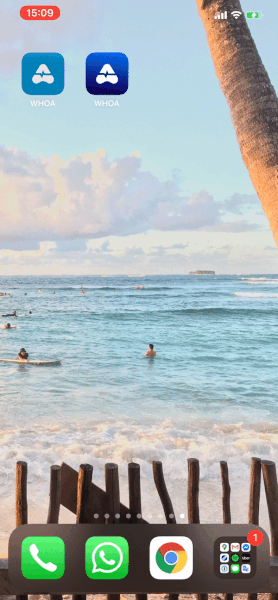

# My WHOA app

Thank you for checking out my app!

Here is an example running on my phone (with dark mode)

## What is included
- 🚀 A captivating launch animation
- ✅ Tests for network requests and location services
- ✅ UI tests for happy path situation 

### and can be added immediately to your WHOA app...
- 📈 Sharing of statistics to social media for virality 
    - You can share some items in the current WHOA app, but pdfs can't go to social media. There are also many other opportunities for sharing functionality to extend the reach of the WHO.
- ◼️ Dark mode support 
    - Users love it and it is not very difficult to implement.
- ··· A working page indicator that changes on tap
    - The page indicator on the Global Literature tab of your app updates the current page on tap, but does not change the displayed page.
- 🗣 Solid Voiceover and accessibility support
    - Your WHOA app could have improvements for accessibility so everyone can use it. Specifically the share icon just says "clipart button" and navigation is odd at times. 

## What is not included 

### for this to go to production
- Better testing and error handling for the network requests
- Handling of cases where location services is denied
- Localizations

### for life cycle management
- UI Tests that can run offline
- Thorough documentation of classes 
    - I've worked on [Source Docs](https://github.com/jhildensperger/sourcedocs) to extract documentation in source files into markdown 📄
- Cleaner implementation of the url for network request
- Color and asset management
- SwiftLint for code quality checks
- Pipeline for continuous integration
- Add multiple schemes for running against different environments
